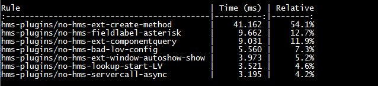

### STEPS TO INSTALL AND CONFIGURE ESLINT TOOL AND CUSTOM RULES**
1. Download and install latest version of [NodeJS](https://nodejs.org/en/).
2. [Download](https://github.com/kshwetabh/ESLint-ExtJS-And-CustomRules/archive/master.zip) the project as zip from github and extract on local machine in a directory.
3. Open **package.json** file and update Eclipse Workspace path (value for hmsFEWorkspace in package.json file) as per your Eclipse workspace.
4. Open command prompt and navigate to the extracted directory. Run the following command. This should install all dependencies required to run the ESLint on your machine   
	```
	npm install
	```
5. To install Custom HMS-ESlint plugin, delete package-lock.json file (don't delete package.json file) and run the following command on command prompt. This should install the custom plugin.   
	```
	npm install -S ./hms_plugin
	```
6. Now run the following command on Command Prompt to run Eslint tool:   
	```
	RunEslint.bat
	```
7. The first run of the tool will take some time (30sec - 1minute) since the tool tries to scan entire workspace. All subsequent runs will be fast.
8. Now in Eclipse whenever you save a JS file, the tool will auto-detect the file changed and will run scan on that changed file.


### IGNORE THE BELOW NOTES IF YOU DON'T PLAN TO DEVELOP OR TIME THE CUSTOM ESLINT PLUGINS (USED ONLY FOR ESLINT PLUGIN DEVELOPMENT)

#### To capture the performance of custom rules run the below command on Command Prompt inside LintTool directory.
It is important to evaluate the impact of each custom rule so that they don't slow down the overall eslint validation time. Included a baseline of the various custom rules.



```shell
C:\> set TIMING=1
C:\> node_modules\.bin\eslint --rule "hms-plugins/no-hms-ext-create-method: 2" --rule "hms-plugins/no-hms-fieldlabel-asterisk: 2" --rule "hms-plugins/no-hms-ext-componentquery: 1" --rule "hms-plugins/no-hms-ext-window-autoshow-show: 2" --rule "hms-plugins/no-hms-servercall-async: 1" --rule "hms-plugins/no-hms-null-undefined: 0" --rule "hms-plugins/no-hms-lookup-start-LV: 1" --rule "hms-plugins/no-hms-bad-variable-names: 0" --rule "hms-plugins/no-hms-bad-lov-config: 1"  C:/Users/ksfnu/eclipseWorkspace/workspace38_Photon/Frontend/src/main/webapp/
```

### Online References:
- [ESLint](https://eslint.org/)
- [ESLint Rules Descriptions](https://eslint.org/docs/rules/)
- [Writing Custom EsLint Rules](https://www.kenneth-truyers.net/2016/05/27/writing-custom-eslint-rules/)

